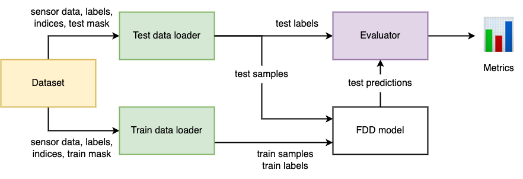

# FDDBenchmark

Benchmarking fault detection and diagnosis methods.

FDDBenchmark is a package for the Python containing 3 components: dataset, dataloader, evaluator. 



Sensor data represented as the dataset is used for creating the dataloader. The dataloader is used for generating samples of sensor data. The evaluator takes labels from testing data loader and labels predicted by a FDD model and reports values of metrics. The package allows to train and evaluate models efficiently in terms of memory and time costs due to the dynamic generation of samples.

## Datasets

FDDBenchmark provides three datasets:
1. `rieth_tep`. Dataset of Tennessee Eastman Process based on the dataset _Rieth, C. A., Amsel, B. D., Tran, R., & Cook, M. B. (2017). Additional Tennessee Eastman Process Simulation Data for Anomaly Detection Evaluation (Version V1) [Computer software]. Harvard Dataverse. https://doi.org/10.7910/DVN/6C3JR1_
2. `reinartz_tep`. Dataset of Tennessee Eastman Process based on the paper _Reinartz, C., Kulahci, M., & Ravn, O. (2021). An extended Tennessee Eastman simulation dataset for fault-detection and decision support systems. Computers & Chemical Engineering, 149, 107281_. The dataset can be found in https://web.mit.edu/braatzgroup/links.html.
3. `small_tep`. Cropped version of `rieth_tep`.

| Dataset  | N of sensors | N of states (faults) | N of runs | Length of a run | Total size |
| - | - | - | - | - | - |
| rieth_tep  | 52  | 21 (20)  | 21000  | 500, 960  | 1.84 GB |
| reinartz_tep  | 52  | 29 (28)  | 2800  | 2000  | 1.88 GB |
| small_tep  | 52  | 21 (20)  | 210  | 500, 960  | 18.9 MB |

## Metrics

Evaluation metrics can be divided into three groups: detection metrics, diagnosis metrics, clustering metrics (used in unsupervised setting).

### Detection metrics
* **Detection TPR** and **Detection FPR**. TPR and FPR in the binary classification task where all faulty samples are positive and all normal samples are negative examples.
* **ADD**, Average Detection Delay. The average number of samples between the first faulty sample and the first detected faulty sample. The averaging is performed among all faulty runs, excluding runs with undetected faults (false negative).

### Diagnosis metrics
* **TPR_i**, True Positive Rate, aka Detection Rate. The number of detected faulty samples of the type i divided by the number of faulty samples of the type i.
* **FPR_i**, False Positive Rate, aka False Alarm Rate. The number of false alarms of the type i divided by the number of normal samples.
* **CDR**, Correct Diagnosis Rate. The total number of correctly diagnosed faulty samples divided by the number of detected faulty samples.

### Clustering metrics
* **ACC**, Unsupervised Clustering Accuracy. Maximum accuracy over all possible matching between cluster indices and ground truth labels.
* **NMI**, Normalized Mutual Information. Mutual information between ground truth labels and cluster indices normalized by the average of their entropies.
* **ARI**, Adjusted Rand Index. The Rand Index considers all pairs of samples and accounts the ratio of pairs with correct cluster index respectively to ground truth labels.

## Installing

FDDBenchmark can be installed using pip as follows:

```
pip install git+https://github.com/airi-industrial-ai/fddbenchmark
```

## Examples

Examples of using FDDBenchmark can be found in the [tutorial](tutorial/tutorial.ipynb).
